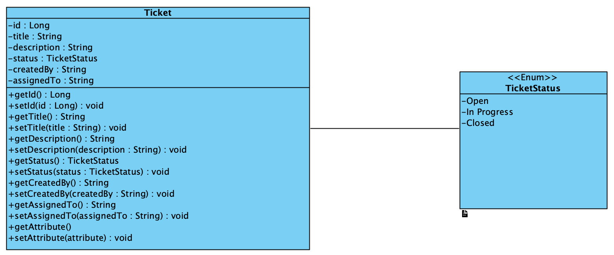

# Ticketsystem
Internet Technology Project Ticket System

#### Contents:
- [Analysis](#analysis)
  - [Scenario](#scenario)
  - [User Stories](#user-stories)
  - [Use Case](#use-case)
- [Design](#design)
  - [Prototype Design](#prototype-design)
  - [Domain Design](#domain-design)
  - [Business Logic](#business-logic)
- [Implementation](#implementation)
  - [Backend Technology](#backend-technology)
  - [Frontend Technology](#frontend-technology)
- [Project Management](#project-management)
  - [Roles](#roles)
  - [Milestones](#milestones)
 

## Analysis
test

### Scenario
Ticketsystem where users can post tickets describing problems or requests. These tickets can then be viewed and worked on by team members, who can update their status and add comments. The goal of the system is to keep track of issues in an organized way and make it easier to manage and resolve them.

### User Stories
1. As an Admin, I want to view a list of all tickets.
2. As an Admin, I want to update the status of tickets (Open, In Progress, Closed).
3. As an Admin, I want to assign tickets to support agents.
4. As an Admin, I want to log in to the system to manage tickets securely.
5. As an Admin, I want a consistent visual appearance so the system is easy to navigate.
6. As a User, I want to create a support ticket describing my issue.
7. As a User, I want to view the status of my submitted tickets.

## Use Case

- UC-1 [View all Tickets]: The Admin retrieves a complete list of tickets in the system.
- UC-2 [View Ticket Details]: The Admin retrieves detailed information for a selected ticket.
- UC-3 [Manage Tickets]: The Admin creates, updates, and deletes tickets.
- UC-4 [Manage Own Tickets]: The User creates, views, and deletes only their own tickets.

## Design

This Ticket System is design as a REST-based backend application using Spring Boot. The API allows Users and Administrators to interact with Tickets through HTTP endpoint.

## Prototype Design

At this Point no frontend prototype is implemented, but you can test it with the "Test.http" file. This can be tested via Intelij or other programs.

## Domain Design

The main entity of the system is:

# Design

## Prototype Design

The Ticket System uses a simple web dashboard interface. Users can log in, create tickets, view existing tickets, edit ticket information, assign tickets to agents, close tickets, and delete tickets. The interface consists of a login area, a ticket creation form, a ticket table, and an edit popup dialog.

(Add screenshot of your frontend here)

## Domain Design

### Ticket

Attributes:
- id : Long
- title : String
- description : String
- status : TicketStatus
- createdBy : String
- assignedTo : String
- createdAt : LocalDateTime
- updatedAt : LocalDateTime

### TicketStatus

Enumeration values:
- OPEN
- IN_PROGRESS
- CLOSED

(Add your UML class diagram screenshot here)

## Business Logic

The system manages support tickets.

Rules:
- Users can create tickets.
- Users can view only their own tickets.
- Administrators can view all tickets.
- Administrators can assign tickets to support agents.
- Administrators can update ticket status.
- Administrators can delete tickets.
- Every ticket has a status of OPEN, IN_PROGRESS, or CLOSED.
- Authentication is required for all ticket operations.

# Implementation

## Backend Technology

- Java 21
- Spring Boot
- Spring Web
- Spring Data JPA
- Spring Security
- H2 Database
- Maven

## Frontend Technology

- HTML
- CSS
- JavaScript
- Fetch API

# Project Management

## Roles

| Member | Responsibilities |
|----------|----------|
| Rafael | Backend development, frontend implementation, GitHub management |
| Manuel | Design and testing |
| Arda | API design and testing |
| Luca | Documentation and frontend support |

## Milestones

- Decide use case
- Create project description
- Draft API specification
- Initial backend setup
- Implement web services
- Enable authentication
- Implement frontend
- Integrate frontend and backend
- Final testing and documentation

