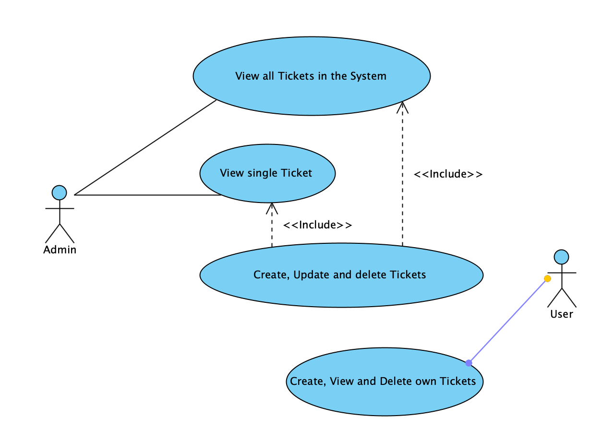

# Ticketsystem
Internet Technology Project Ticket System

#### Contents:
- [Analysis](#analysis)
  - [Scenario](#scenario)
  - [User Stories](#user-stories)
  - [Use Case](#use-case)
- [Design](#design)
  - [Prototype Design](#prototype-design)
  - [Domain Design](#domain-design)
  - [Business Logic](#business-logic)
- [Implementation](#implementation)
  - [Backend Technology](#backend-technology)
  - [Frontend Technology](#frontend-technology)
- [Project Management](#project-management)
  - [Roles](#roles)
  - [Milestones](#milestones)
 

## Analysis
test

### Scenario
Ticketsystem where users can post tickets describing problems or requests. These tickets can then be viewed and worked on by team members, who can update their status and add comments. The goal of the system is to keep track of issues in an organized way and make it easier to manage and resolve them.

### User Stories
1. As an Admin, I want to view a list of all tickets.
2. As an Admin, I want to update the status of tickets (Open, In Progress, Closed).
3. As an Admin, I want to assign tickets to support agents.
4. As an Admin, I want to log in to the system to manage tickets securely.
5. As an Admin, I want a consistent visual appearance so the system is easy to navigate.
6. As a User, I want to create a support ticket describing my issue.
7. As a User, I want to view the status of my submitted tickets.

## Use Case

- UC-1 [View all Tickets]: The Admin retrieves a complete list of tickets in the system.
- UC-2 [View Ticket Details]: The Admin retrieves detailed information for a selected ticket.
- UC-3 [Manage Tickets]: The Admin creates, updates, and deletes tickets.
- UC-4 [Manage Own Tickets]: The User creates, views, and deletes only their own tickets.
